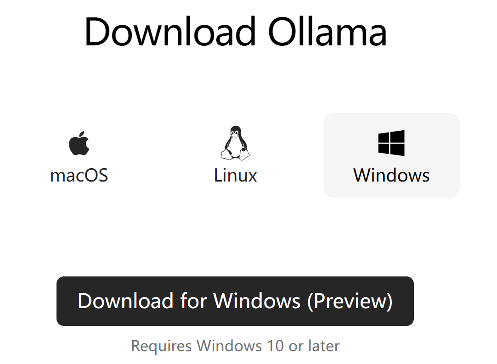

# llama3-8b本地部署

Llama 3，是Meta公司发布的大型语言模型。llama3-8b为其中一个版本，参数量80亿（8B），文件大小4.7Gb，上下文窗口为8k。

在架构层面，Llama3选择了标准的仅解码（decoder-only）式Transformer架构，采用包含128K token词汇表的分词器。Llama 3在Meta自制的两个24K GPU集群上进行预训练，使用了超过15T的公开数据，其中5%为非英文数据，涵盖30多种语言，训练数据量是前代Llama 2的七倍，包含的代码数量是Llama 2的四倍。

根据Meta的测试结果，Llama 3 8B模型在MMLU、GPQA、HumanEval等多项性能基准上均超过了Gemma 7B和Mistral 7B Instruct，70B模型则超越了名声在外的闭源模型Claude 3的中间版本Sonnet，和谷歌的Gemini Pro 1.5相比三胜两负。

## 部署设备

本次部署设备为个人笔记本电脑，以下为计算机主要软硬件配置：

- 型号：Razer Blade Studio 15
- CPU：i7-9750H 2.60GHz
- RAM：48GB
- GPU：Nvidia Quadro RTX 5000 with Max-Q Design 16GB
- 操作系统：Windows 10 专业版

## 部署过程

#### Ollama

Ollama是一个开源的大型语言模型服务工具，它帮助用户快速在本地运行大模型。通过简单的安装指令，用户可以执行一条命令就在本地运行开源大型语言模型，如[Llama 3](https://cloud.baidu.com/product/wenxinworkshop)。Ollama极大地简化了在Docker容器内部署和管理LLM的过程，使得用户能够快速地在本地运行大型语言模型。

要下载Ollama，直接进入其[官网]([Ollama](https://ollama.com/))即可下载。Ollama分别提供了针对Mac、Linux和Windows用户的客户端，选择与操作系统相对应的版本进行下载，在这里我们下载Windows版本。



#### llama3-8b

llama-8b的基准模型，可以直接在ollama中通过命令行下载，不添加额外参数，默认下载8b版本。

使用Win+R打开运行输入cmd进入命令行，输入下列代码：

```
ollama run llama3
```

ollama会自动下载并安装llama3-8b版本，下次运行时使用同样的流程和代码打开。

#### llama3-8b-inst

llama3-8b-inst是基于基准版llama3-8b版本的微调版，修复了中文回复时的一些错误，具有更好的对话体验。在[阿里魔搭社区](https://www.modelscope.cn/home)搜索并下载指定模型文件，使用以下代码编写模型文件。

```
FROM D:/ollamamodels/ggml-model-q8_0.gguf
TEMPLATE """{{ if .System }}<|start_header_id|>system<|end_header_id|>

{{ .System }}<|eot_id|>{{ end }}{{ if .Prompt }}<|start_header_id|>user<|end_header_id|>

{{ .Prompt }}<|eot_id|>{{ end }}<|start_header_id|>assistant<|end_header_id|>

{{ .Response }}<|eot_id|>"""
SYSTEM """"""
PARAMETER num_keep 24
PARAMETER stop <|start_header_id|>
PARAMETER stop <|end_header_id|>
PARAMETER stop <|eot_id|>
PARAMETER stop assistant
PARAMETER stop Assistant
```

修改文本文件的名称为Modelfile.txt，在Modelfile所在的文件夹下打开cmd使用ollama create命令，等待ollama输出success就导入成功了。

```
ollama create model-name -f Modelfile.txt
```

